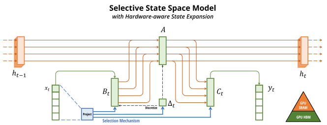

# Awesome-Mamba

 

**👉 Please consider giving this repository a star ⭐ if you find it helpful!**

## News

### [02/12/2024] The repo is currently updating, you can follow it for the latest updates!

> **Mamba-UNet: UNet-Like Pure Visual Mamba for Medical Image Segmentation** 
> Ziyang Wang, Jian-Qing Zheng, Yichi Zhang, Ge Cui, Lei Li 
> _**Preprint**_ 
>  
> 

> **Can Mamba Learn How to Learn? A Comparative Study on In-Context Learning Tasks** 
> Jongho Park, Jaeseung Park, Zheyang Xiong, Nayoung Lee, Jaewoong Cho, Samet Oymak, Kangwook Lee, Dimitris Papailiopoulos 
> _**Preprint**_ 
>  
> 

> **U-shaped Vision Mamba for Single Image Dehazing** 
> Zhuoran Zheng, Chen Wu 
> _**Preprint**_ 
>   
> 

> **Is Mamba Capable of In-Context Learning?** 
> Riccardo Grazzi, Julien Siems, Simon Schrodi, Thomas Brox, Frank Hutter 
> _**Preprint**_ 
>  
> 

> **Graph-Mamba: Towards Long-Range Graph Sequence Modeling with Selective State Spaces** 
> Chloe Wang, Oleksii Tsepa, Jun Ma, Bo Wang 
> _**Preprint**_ 
>   
> 

> **SegMamba: Long-range Sequential Modeling Mamba For 3D Medical Image Segmentation** 
> Zhaohu Xing, Tian Ye, Yijun Yang, Guang Liu, Lei Zhu 
> _**Preprint**_ 
>   
> 

> **Vision Mamba: Efficient Visual Representation Learning with Bidirectional State Space Model** 
> Lianghui Zhu, Bencheng Liao, Qian Zhang, Xinlong Wang, Wenyu Liu, Xinggang Wang 
> _**Preprint**_ 
>   
> 

> **MoE-Mamba: Efficient Selective State Space Models with Mixture of Experts** 
> Maciej Pióro, Kamil Ciebiera, Krystian Król, Jan Ludziejewski, Sebastian Jaszczur 
> _**Preprint**_ 
>  
> 

> **Mamba: Linear-Time Sequence Modeling with Selective State Spaces** 
> Albert Gu, Tri Dao 
> _**Preprint**_ 
>   
> 

